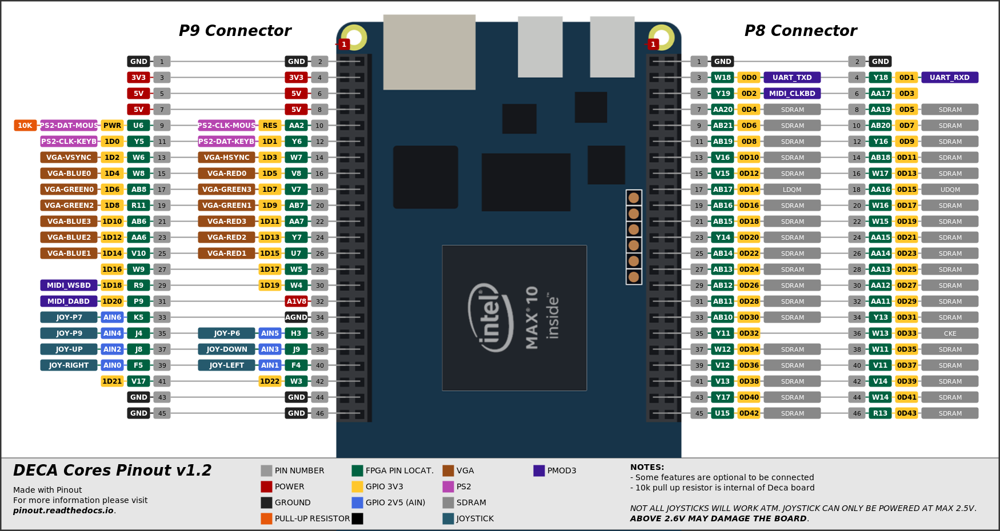

# NES DeMiSTified

16/11/21 DECA port by Somhic from Alastair M.Robinson DeMiSTified port https://github.com/robinsonb5/nes which was ported from original Gyurco's MiST core https://github.com/mist-devel/nes

**(THIS PORT REQUIRES AN SDRAM MODULE WITH SEPARATED DQMH/L SIGNALS - 3 pins old MiSTer memory modules should work)**

**Now compatible with [Deca Retro Cape 2](https://github.com/somhi/DECA_retro_cape_2)** (new location for 3 pins of old SDRAM modules). Otherwise see pinout below to connect everything through GPIOs.

Special thanks to Alastair M. Robinson creator of [DeMiSTify](https://github.com/robinsonb5/DeMiSTify) for helping me. 

[Read this guide if you want to know how I DeMiSTified this core](https://github.com/DECAfpga/DECA_board/tree/main/Tutorials/DeMiSTify).

**Features for Deca board:**

* HDMI video output
* VGA 444 video output is available through GPIO (see pinout below)
* Line out (3.5 jack green connector) and HDMI audio output
* PWM audio is available through GPIO (see pinout below)
* Joystick available through GPIO  (see pinout below).  **Joystick power pin must be 2.5 V**
  * **DANGER: Connecting power pin above 2.6 V may damage the FPGA**
  * This core was tested with a Megadrive 6 button gamepad. A permanent high level is applied on pin 7 of DB9, so only works buttons B and C.

**Additional hardware required**:

- SDRAM module. Tested with a dual memory module v1.3 with 3 pins ([see connections](https://github.com/SoCFPGA-learning/DECA/tree/main/Projects/sdram_mister_deca) + [3pins](https://github.com/DECAfpga/DECA_board/blob/main/Sdram_mister_deca/README_3pins.md))
- PS/2 Keyboard connected to GPIO  (see pinout below)

##### Versions:

* v3.4  added NeptUNO board. Solved problem with Deca SDRAM (optimizeforspeed 1 is needed)

### Instructions to compile the project for a specific board:

(Note that sof/svf files are already included in /deca/output_files/)

```sh
git clone https://github.com/DECAfpga/NES_Demistify
cd NES_Demistify
#Do a first make (will finish in error) but it will download missing submodules 
make
cd DeMiSTify
#Create file site.mk in DeMiSTify folder 
cp site.template site.mk
#Edit site.mk and add your own PATHs to Quartus (Q19)
gedit site.mk
#Go back to root folder and do a make with board target (deca, neptuno, uareloaded). If not specified it will compile for all targets.
cd ..
make BOARD=deca
#when asked just accept default settings with Enter key
```

After that you can:

* Flash bitstream directly from [command line](https://github.com/DECAfpga/DECA_binaries#flash-bitstream-to-fgpa-with-quartus)
* Load project in Quartus from /deca/nes_deca.qpf

### Pinout connections:



Mouse is not required to use this core

For 444 video DAC use all VGA pins. For 333 video DAC connect MSB from addon to MSB of location assignment (e.g. connect pin VGAR2 from Waveshare addon to VGA_R[3] Deca pin).

**Others:**

* Button KEY0 is a reset button

### STATUS

* Working fine

* HDMI video outputs special resolution so will not work on all monitors. 

### OSD Controls

* F12 show/hide OSD 
* The reset button KEY0 resets the controller (so re-initialises the SD card if it's been changed, reloads any autoboot ROM.) The OSD Reset menu item resets the core itself.


### Follows original core README.md:


# nes

This is a port of Luddes NES core to the MIST and Turbo Chameleon 64. See his FPGANES blog at http://fpganes.blogspot.de for details. The original source code can be found at https://github.com/strigeus/fpganes
Many changes ported from https://github.com/MiSTer-devel/NES_MiSTer
The MiST version can be found at https://github.com/mist-devel/nes

The Turbo Chameleon 64 port wraps the MiST core in a compatibility layer (DeMiSTify, by Alastair M. Robinson), and makes no material changes to the core itself.

# Controls

Since the Turbo Chameleon 64 can't support more than three gamepad buttons via the DB9 ports, the extra buttons are mapped as follows:

## Gamepad 1

| Gamepad button | PS/2 keyboard | C64 keyboard | CDTV controller |
| :------------- | :------------ | :----------- | :-------------- |
| Start          | Enter         | Return       | Play*           |
| Select         | Right shift   | Right shift  | Volume up*      |
| Button A       | Right Alt     |              | Button B        |
| Button B       | Right Ctrl    |              | Button A        |

## Gamepad 2

| Gamepad button | PS/2 keyboard | C64 keyboard | CDTV controller |
| :------------- | :------------ | :----------- | :-------------- |
| Start          | Caps Lock     | Run/Stop     | Play*           |
| Select         | Left shift    | Left shift   | Volume up*      |
| Button A       | Left Ctrl     |              | Button B        |
| Button B       | Left Alt      |              | Button A        |

## Other keys

| Function | PS/2 keyboard | C64 keyboard     | CDTV controller |
| :------- | :------------ | :--------------- | :-------------- |
| Menu     | F12           | &lt;- (top left) | Power           |

